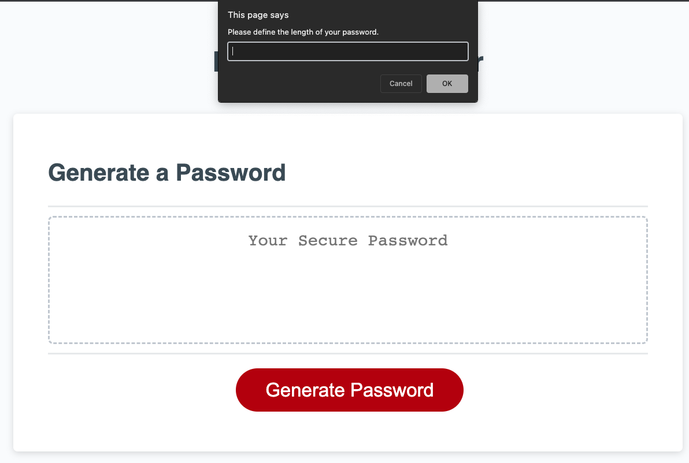

# Portfolio Mini Project 

## Description

For this project, we need to create a way for the password generator to prompt the user for inputs in order to generate a password to specifications. Though the exercise, I got to practice working with variables, functions, and conditional statements. The most challenging part of the exercise was iterating over the characters to generate the password. 

## Installation

Go to https://github.com/BobbyCharms/password-generator to view or download the repo and its contents. 

For the live website, visit this link: https://bobbycharms.github.io/password-generator/

You should see: 

## License

N/A

## How to Contribute

This project welcomes feedback and suggestions! Please feel free to download the code, make your proposed changes, and submit a pull request or reach out to me directly with recommendations!

## Tests

N/A